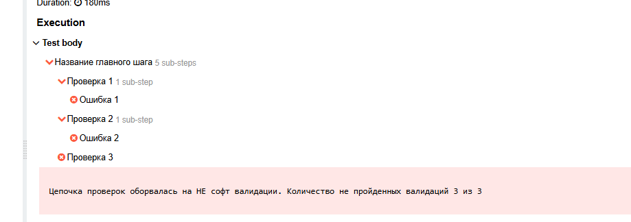

# Документация по инструменту валидаций.
1. [Описание](#description)
2. [Сторонние зависимости](#dependencies)
3. [ValidatorFabric - основная часть инструмента](#validatorFabric)
   1. [Общее](#generalMoments)
      1. [Важные моменты в целом](#generalMoment)
      2. [Чем отличается Supplier<'Boolean'> condition от boolean condition?](#supplierMoment)
      3. [GroupSoft - проверки](#groupSoft)
   2. [AssertValidation](#assertValidation)
      1. [Доступные методы](#assertionAvailableMethod)
   3. [ResponseValidation](#responseValidation)
      1. [Доступные методы](#responseAvailableMethod)
4. [Дополнительно по ValidatorFabric](#additionalValidatorFabric)
   1. [AllureConfig](#allureConfig)
   2. [Настройка стек-трейса](#settingsStackTrace)

# 1. Описание: 
Инструмент состоит из 2-ух частей. 
Первая часть - это непосредственно инструмент валидаций -> ValidatorFabric. 
Вторая часть - это архитектурное решение, помогающее удобнее валидировать ответы (Response) -> от RestAssured, при этом есть возможность писать собственные валидаторы.
  

ValidatorFabric - из главных возможностей. 
1. Вызывать soft валидации в цепочке проверок. (при этом миксуя их с НЕ софт валидациями) 
2. Логически распределять проверки по группам. 
3. Заполнение Allure-отчета. 
4. Удобный стек-трейс после завершения цепочек валидаций. (при необходимости можно вызвать полный стек-трейс). 
5. Возможность включать/отключать Allure.
  

# 2. Сторонние зависимости: 
В данном разделе не будет версий библиотек, т.к. я не тестировал различные версии 
Плюс не всегда будет указана зависимость, а будет просто указан пакет с классом -> при необходимости этой информации будет достаточно для понимания. 
1. io.rest-assured:rest-assured 
2. org.junit.jupiter.api.Assertions -> по факту можно заменить на какой-нибудь другой Assertions. 
3. io.qameta.allure 
4. com.github.erosb:everit-json-schema 
5. com.fasterxml.jackson
  

# 3. ValidatorFabric - основная часть инструмента. 
Отправной точкой является обращение к классу ValidatorFabric 
 

Как видно из скриншота, есть 3 разные вариации вызова фабрики.
1. AssertValidation - предоставляет проверки утверждения. 
2. ResponseValidation - предоставляет проверки для валидации ответа от RestAssured. 
3. ComplexValidation - предоставляет проверки, как из AssertValidation, так и из ResponseValidation. Описан не будет, т.к. это лишь совокупность двух валидаторов (соотв. имеет все ровно тоже самое).
  

# 3.1 Общее. 

# 3.1.1 <u>**Сразу по важным моментам, которые далее объяснятся не будут.**</u> 
1. Все цепочки <u>**должны**</u> завершаться методом validate. Там происходят системные шаги -> по завершению Allure. 
   Но это не означает, что проверки - ленивые. Нет. Проверка вызывается ровно в тот момент - когда происходит ее вызов. 
2. У каждого обычного метода, <u>**чаще всего есть 2 варианта**</u>, без постфикса Soft и с постфиксом Soft. 
   <u>Soft</u> - указывает на то, что в случае ПАДЕНИЯ этой проверки, цепочка проверок не завершится, а пойдет дальше. 
   <u>НЕ Soft</u> - указывает на то, что в случае ПАДЕНИЯ этой проверки, цепочка проверок завершится, далее проверки НЕ пойдут. 
3. <u>String allureStepName</u> - это то, как будет отображаться шаг проверки в Allure-отчете. Если данного параметра у метода нет -> значит есть значение по умолчанию. 
4. <u>String errorMessage</u> - если данные параметр заполнен, в allure-отчете под упавший шаг проверки - будет добавлен еще один шаг, с описание которое вы указали под этот параметр. 
5. Чем отличается Supplier<'Boolean'> condition от boolean condition? Там где вы видите в ожидаемом результате принимает Supplier - действует это правило, которое я опишу ниже  
   Пример по данным аспектам, из кода: 
    
   Пример консоли, исходя из этой цепочки проверок: 
    
   Пример Allure-отчета: 
    

Что мы видим:
1. Название главного шага 
2. Описание ошибки - там где указан errorMessage 
3. Название шагов (проверок) - так, как указано в allureStepName 
4. То что не было вызова четвертой валидации, т.к. перед ней был вызов НЕ Soft валидации, и она не прошла. 

# 3.1.2 Чем отличается Supplier<'Boolean'> condition от boolean condition? 
Посмотрим пример из кода: 
 

А теперь запустим тест, и посмотрим Allure-отчет: 
 
Как видим из отчета, там где мы передавали метод с шагом - без функции, там этот шаг "улетел из контекста". 
Там где мы передавали метод с шагом - как функцию, там этот шаг находится в контексте. 

Вывод, если в ожидаемый результат - передается метод, или действие который/ое фиксируется в Allure-отчете, то
необходимо передовать этот метод/действие - в виде функции Supplier.  

# 3.1.3 GroupSoft - проверки 
Рассмотрим сразу на коде: 
 
Что мы здесь видим? 
Мы вызываем на главным уровне две групповых проверки. 
1. Первая групповая проверка - содержит в себе 2 валидации, одна из них упадет. Соответственно групповая проверка считается проваленной. 
2. Вторая групповая проверка - содержит в себе 2 групповые проверки, первая групповая проверка - будет проваленной. Вторая групповая проверка будет успешной. 
   Т.к вторая групповая проверка - состоит из 2 подгрупповых проверок, и одна из них будет проваленной, соответственно главная групповая проверка - будет проваленной. 
   Посмотрим внимательно Allure-отчет: 
    

Важные моменты для групповых проверок: 
1. Можно в групповых проверках вызывать групповые проверки (сколько угодно -> главное не запутайтесь) 
2. В групповых проверках - вам будут доступны только Soft валидации, нельзя будет вызвать обычную. 
3. В групповых проверках - не нужно создавать новый валидатор, пользуйтесь параметром которое дает lambda выражение ->
   nestedBuilder -> nestedBuilder.assertTrueSoft(). 
   Если вы вызвали в групповой проверке - групповую проверку, вы не сможете назвать параметр опять nestedBuilder, т.к. будет конфликт имен. 
   Вам нужно будет назвать nestedValidator2 (например), и тогда используйте внутри этой групповой проверки именно эту переменную. 
   Пример: 
    

# 3.2 AssertValidation. 
При вызове фабрики предоставляется 2 метода: 
 

Дают доступ до данного типа проверок: 
<u>beginAssertValidation()</u> - В аллюр печатается шаг по умолчанию -> "Проверки (Assert)". 
<u>beginAssertValidation(String allureStepName)</u> - В аллюр печатается шаг - заданный пользователем. 
 
Этот шаг будет являться главным в Allure-отчете для проверок - которые будут далее вызываться по цепочке. 
<u>Пример</u>:
 

# 3.2.1 Доcтупные методы 
## AssertTrue
assertTrue(String allureStepName, boolean condition) 
assertTrue(String allureStepName, boolean condition, String errorMessage) 
assertTrue(String allureStepName, Supplier<'Boolean'> condition) 
assertTrue(String allureStepName, Supplier<'Boolean'> condition, String errorMessage) 

Имеются аналоги -> Soft

## AssertFalse
assertFalse(String allureStepName, boolean condition) 
assertFalse(String allureStepName, boolean condition, String errorMessage) 
assertFalse(String allureStepName, Supplier<'Boolean'> condition) 
assertFalse(String allureStepName, Supplier<'Boolean'> condition, String errorMessage) 

Имеются аналоги -> Soft

## AssertEquals
assertEquals(String allureStepName, T actual, T expected); 
assertEquals(String allureStepName, T actual, T expected, String errorMessage); 
assertEquals(String allureStepName, Supplier<'T'> actual, T expected); 
assertEquals(String allureStepName, Supplier<'T'> actual, T expected, String errorMessage); 
assertEquals(String allureStepName, Supplier<'T'> actual, Supplier<'T'> expected);
assertEquals(String allureStepName, Supplier<'T'> actual, Supplier<'T'> expected, String errorMessage); 
assertEquals(String allureStepName, T actual, Supplier<'T'> expected); 
assertEquals(String allureStepName, T actual, Supplier<'T'> expected, String errorMessage); 

Имеются аналоги -> Soft

## AssertNotEquals
assertNotEquals(String allureStepName, T actual, T expected); 
assertNotEquals(String allureStepName, T actual, T expected, String errorMessage); 
assertNotEquals(String allureStepName, Supplier<'T'> actual, T expected); 
assertNotEquals(String allureStepName, Supplier<'T'> actual, T expected, String errorMessage); 
assertNotEquals(String allureStepName, Supplier<'T'> actual, Supplier<'T'> expected);
assertNotEquals(String allureStepName, Supplier<'T'> actual, Supplier<'T'> expected, String errorMessage); 
assertNotEquals(String allureStepName, T actual, Supplier<'T'> expected); 
assertNotEquals(String allureStepName, T actual, Supplier<'T'> expected, String errorMessage); 

Имеются аналоги -> Soft

## AssertNull
assertNull(String allureStepName, Object object); 
assertNull(String allureStepName, Object object, String errorMessage); 
assertNull(String allureStepName, Supplier<'Object'> object); 
assertNull(String allureStepName, Supplier<'Object'> object, String errorMessage); 

Имеются аналоги -> Soft

## AssertNotNull
assertNotNull(String allureStepName, Object object); 
assertNotNull(String allureStepName, Object object, String errorMessage); 
assertNotNull(String allureStepName, Supplier<'Object'> object); 
assertNotNull(String allureStepName, Supplier<'Object'> object, String errorMessage); 

Имеются аналоги -> Soft

## AssertLocalDateTime
assertLocalDateTime(String nameActualDate, String nameExpectedDate, LocalDateTime actual, LocalDateTime expected, DateTimeFormatter format); 
Пример позитивный: 
 
Отчет в аллюре: 
 
Пример негативный: 
 
Отчет в аллюре: 
 

Имеются аналоги -> Soft

## AssertZonedDateTimeWithTolerance
Позволяют сравнить два ZonedDateTime с погрешностью. 
В чем измеряется погрешность, указано в названии метода. 
Допустимая величина указывается последним параметром в методе. 
Не важно в каком UTC - ZonedDateTime, они могут быть в разных UTC. 
Не важно в каком порядке передаются ZonedDateTime, в любом случае найдет ошибку несоответствия дат. 

assertZonedDateTimeWithToleranceHours(String allureStepName, ZonedDateTime z1, ZonedDateTime z2, long allowDifferenceHours); 
assertZonedDateTimeWithToleranceHours(String allureStepName, Supplier<'ZonedDateTime'> z1, ZonedDateTime z2, long allowDifferenceHours); 
assertZonedDateTimeWithToleranceHours(String allureStepName, ZonedDateTime z1, Supplier<'ZonedDateTime'> z2, long allowDifferenceHours); 
assertZonedDateTimeWithToleranceHours(String allureStepName, Supplier<'ZonedDateTime'> z1, Supplier<'ZonedDateTime'> z2, long allowDifferenceHours); 

Пример позитивный: 
 
Отчет в аллюре: 
 
Пример негативный: 
 
Отчет в аллюре: 
 

Имеются ровно такие же методы, только Minutes, Second.
Имеются аналоги -> Soft для каждого метода.

## AssertThatCodeDoesNotException
Позволяет передать функцией - код, подразумевается изначально какой-то ассерт из сторонней библиотеки. 

assertThatCodeDoesNotException(String allureStepName, ThrowingCallable call); 
assertThatCodeDoesNotException(String allureStepName, ThrowingCallable call, String errorMessageAllure); 

allureStepName - то как будет называться валидация в Allure. 
ThrowingCallable call - функция, описывающая код - который по итогу будет выполнятся и если выполнился без выброса исключения - считается успешной проверкой. 
String errorMessageAllure - дополнительное описание ошибки, которое будет отображаться в Allure в случае неуспешной проверки. 
При ошибке -> в консоли будет указано описание из исключения которое было вызвано. 

Примеры: 
 
Отчет в аллюре: 
 

Имеются аналоги -> Soft для каждого метода.

# 3.3 ResponseValidation. 
При вызове фабрики предоставляется несколько методов. 
 
Response - объект от RestAssured
Responsible - интерфейс (кастомный), для случая, если вы оборачиваете Response в другой объект. 
Тогда "другой объект" должен реализовывать данный интерфейс. 

# 3.3.1 Доcтупные методы 
## Body
Универсальный метод, с помощью которого можно подставить свой matcher. 
body(String jsonPath, Matcher<'T'> matcher); 
body(String jsonPath, Matcher<'T'> matcher, String allureErrorMessage); 
body(String allureStepName, String jsonPath, Matcher<'T'> matcher); 
body(String allureStepName, String jsonPath, Matcher<'T'> matcher, String allureErrorMessage); 

Код: 
 
Allure-отчет и валидируемый json: 
 

Имеются аналоги -> Soft для каждого метода.

## BodyHasAttribute
bodyHasAttribute(String parentJsonPath, String attribute); 
bodyNotHasAttribute(String parentJsonPath, String attribute); 

Код: 
 
Allure-отчет и валидируемый json: 
 

Имеются аналоги -> Soft для каждого метода.

## BodyNotHasAttribute
bodyHasAttribute(String parentJsonPath, String attribute); 
bodyNotHasAttribute(String parentJsonPath, String attribute); 

Код: 
 
Allure-отчет и валидируемый json: 
 

Имеются аналоги -> Soft для каждого метода.

## BodyArray
bodyArrayEmpty(String jsonPath);
bodyArraySizeEquals(String jsonPath, int expectedSize);

Код: 
 
Allure-отчет и валидируемый json: 
 

Имеются аналоги -> Soft для каждого метода.

## BodyEquals && BodyContains && StatusCode
bodyEquals(String jsonPath, T expectedValue); 
bodyContains(String jsonPath, String containsValue); 
statusCode(int expectedStatus); 
statusCodeOrElse(int expectedStatus, Consumer<Response> orElse) - функция выполнится только в случае если проверка упадет 
statusCodeAndElse(int expectedStatus, Consumer<Response> andElse); - функция выполнится в любом случае (упадет или пройдент не важно) 

Код: 
 
Allure-отчет и валидируемый json: 
 

Имеются аналоги -> Soft для каждого метода.

## HeaderEquals && HeaderContains
headerEquals(String header, String expectedValue); 
headerContains(String header, String containsValue); 

Код: 

Allure-отчет и валидируемый json: 

Имеются аналоги -> Soft для каждого метода.

## JsonSchema
matchesJsonSchema(String schema); 

Данный метод -> использует библиотеку com.github.erosb:everit-json-schema. 
Вам необходимо написать схему, и передать ее в этот метод. 
Хранение схемы определяете сами (рекомендую в ресурсах) 

Пример отчета при падении теста по схеме: 
 

Прикладывается сама схема, и ошибки схемы. 

Имеются аналоги -> Soft для каждого метода.

## BodyEqualsFile
bodyEqualsFile(String pathFile) 

Данный метод -> использует библиотеку com.fasterxml.jackson. 
Преобразует ответ и ваш файл к JsonNode и сравнивает их. 

Пример вызова: 
.bodyEqualsFileSoft("testFiles/dictionaries/cardSettings/create/feature-create.json") 
Расположение файла: 

Имеются аналоги -> Soft для каждого метода.

# 4. Дополнительно по ValidatorFabric: 

# 4.1 AllureConfig: 
Предоставляется возможность отключать конфигурировать Allure. 
 

Подробнее про каждую: 
disableSoftName 
Код: 
 
Allure отчет: 
 

disableValidationName 
Код: 
 
Allure отчет: 
 

disableMessageError - работает по аналогии. Отключает шаги описаний ошибок.   
Делаем вывод -> что каждый параметр отвечает за конкретную сущность. 
ВАЖНО. Эта конфигурация отвечает только за аллюр, логика инструмента не меняется никак. 
По умолчанию все шаги включены. 
Это не глобальные настройки, это настройки для конкретного Validator. То есть, когда вы вызываете ValidatorFabric.beginAssertValidation -> создается новый Validator и для него опять по умолчанию весь Allure будет включен.

# 4.2 Настройка стек-трейса: 
После переноса валидатора себе, вам нужно изменить одну строчку кода, для того чтобы по умолчанию был красивый стек-трейс 
 

Нужно указать groupId вашего проекта. 
Как его можно определить в проекте: 
 
Как его можно определить в gradle: 
 

Чтобы включить полный стек-трейс, у вас должна быть установлена Env переменная debug -> с значением true.

